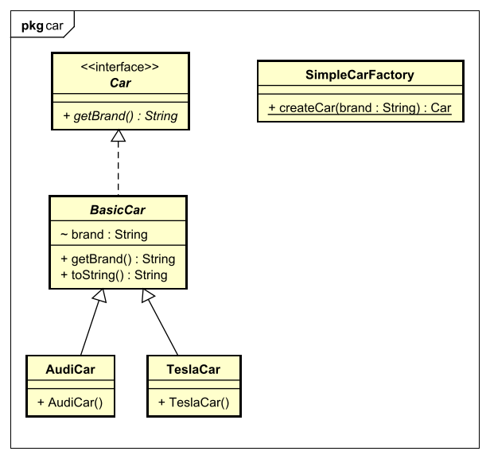

# Simple Factory
Dies is eigentlich kein Pattern. Es lagert jegendlich das erstellen der Instanz in eine eigene Klasse aus.
Damit man eben nur einen Ort hat wo man etwas ändern muss um etwas hinzuzufügen oer zu entfernen.

