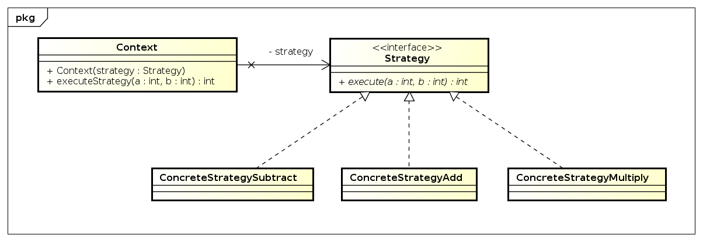
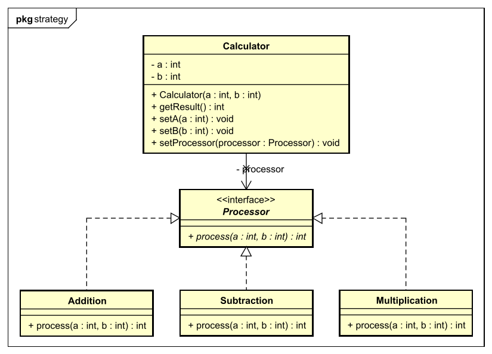

# Strategy Pattern

Eine möglichkeit zu haben ein bestimmtes verhalten dynamich zu gestalten.

## UML

## Bsp
Mein Bespiel ist ein "Processor" welcher über eine bestimte Strategy (Addition, Substraction, Multiplikation)
eine mathematische Operation ausführt. 

